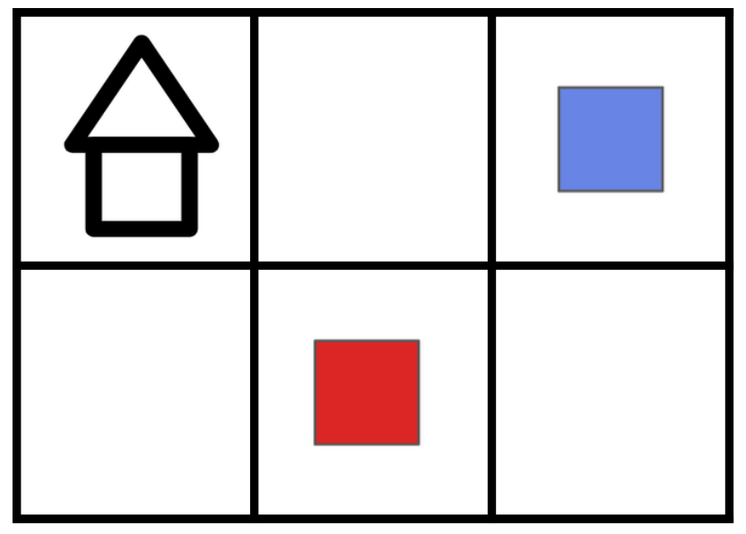

# Tinytown Environment Specification

A discrete environment based on an $n \times m$ grid.
Each timestep the agent places resources onto empty grid squares,
if these resources are in the correct patterns, they can be turned into buildings.
The environment alternates between a _resource phase_ where the agent places a resource on an empty square,
and a _building phase_ where the agent converts groups of respurces into a single building.

Based on the board game [Tiny Towns](https://www.petermcpherson.com/games/tiny-towns) by Peter McPherson.

| Parameter        | Type         | Description              |
|------------------|--------------|--------------------------|
| Grid Height: $n$ | $\mathbb{N}$ | Height of the town grid. |
| Grid Length: $m$ | $\mathbb{N}$ | Length of the town grid. |

| Property                | Value                                             | Upper Bound             |
|-------------------------|---------------------------------------------------|-------------------------|
| $\vert\mathcal{S}\vert$ | ~                                                 | $2\times{{5}^{nm}} - 1$ |
| $\vert\mathcal{A}\vert$ | $2{\left(nm\right)}^{2} + 2{\left(nm\right)} + 1$ | ~                       |

| Feature                            | Value |
|------------------------------------|-------|
| Deterministic                      | Yes   |
| Directed                           | Yes   |
| Continual                          | No    |
| All Actions Possible in all States | No    |

## State Space

**Type:** Matrix of size $\left(n + 1\right) \times \left(m + 1\right)$
with values from $\left\lbrace0, 1, 2, 3, 4\right\rbrace$.
More formally: ${\left\lbrace0, 1, 2, 3, 4\right\rbrace}^{m + 1 \times n + 1}$.

**Upper bound:** $2\times{{5}^{nm}} - 1$.

A state is a $n + 1 \times m + 1$ matrix where the $\left(i, j\right)$ index shows the
resource or building contained in the $\left(i, j\right)$ square in the town.
The value is $0$ if the grid square is empty. The value at index $\left(n, m\right)$ is $0$ 
if the state is in the _resource phase_, or $1$ if the state is in the _building phase_.

## Action Space

**Type:** A vector of length $6$ containing natural numbers ($\mathbb{N}^{6}$).

Actions correspond to either placing a specific resource at a grid location,
converting a group of resources centered on a location into a building at another location,
and ending the building phase.

| Action                                              | Description                                                                                                                                                                           | Conditions                                                                                                                                                                                                                       |
|-----------------------------------------------------|---------------------------------------------------------------------------------------------------------------------------------------------------------------------------------------|----------------------------------------------------------------------------------------------------------------------------------------------------------------------------------------------------------------------------------|
| $\left(i, j, 0, \cdot, \cdot, 0\right)$             | Where $0 \leq i < n$ and $0 \leq j < m$.  Place a _brick_ at grid square $\left(i, j\right)$.                                                                                     | The square at $\left(i, j\right)$ must be empty and the state cannot be in the resource phase.                                                                                                                               |
| $\left(i, j, 1, \cdot, \cdot, 0\right)$             | Where $0 \leq i < n$ and $0 \leq j < m$.  Place _glass_ at grid square $\left(i, j\right)$.                                                                                       | The square at $\left(i, j\right)$ must be empty and the state cannot be in the resource phase.                                                                                                                               |
| $\left(i, j, 0, \hat{i}, \hat{j}, 1\right)$         | Where $0 \leq i, \hat{i} < n$ and $0 \leq j, \hat{j} < m$. Use the resource pattern centered at $\left(i, j\right)$ to place a cottage at $\left(\hat{i}, \hat{j}\right)$.    | The squares from $\left(i, j\right)$ to $\left(i + 1, j + 1\right)$ contain the cottage resource pattern, $i - 1 \leq \hat{i}\leq i + 1$, $j - 1 \leq \hat{j}\leq j + 1$, and the state is in the building phase.    |
| $\left(i, j, 1, \hat{i}, \hat{j}, 1\right)$         | Where $0 \leq i, \hat{i} < n$ and $0 \leq j, \hat{j} < m$. Use the resource pattern centered at $\left(i, j\right)$ to place a greenhouse at $\left(\hat{i}, \hat{j}\right)$. | The squares from $\left(i, j\right)$ to $\left(i + 1, j + 1\right)$ contain the greenhouse resource pattern, $i - 1 \leq \hat{i}\leq i + 1$, $j - 1 \leq \hat{j}\leq j + 1$, and the state is in the building phase. |
| $\left(\cdot, \cdot, \cdot, \cdot, \cdot, 2\right)$ | End the building phase.                                                                                                                                                               | The state must be in the building phase.                                                                                                                                                                                         |

## Transition Dynamics
In tinytown there are two resources:

bricks: 
